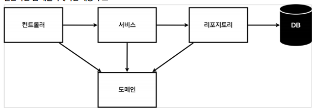
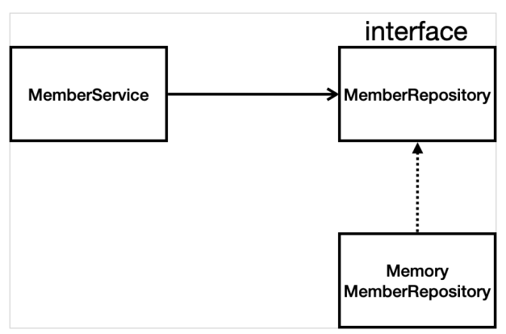

# 비즈니스 요구사항 정리

#### 일반적인 웹 어플리케이션 계층 구조

- Controller : 웹 MVC의 컨트롤러 역할
- Service : 핵심 비즈니스 로직 구현
    예) 회원은 중복 가입이 안됨
- Repository : 데이터베이스에 접근, 도메인 객체를 DB에 저장하고 관리
- 도메인 : 비즈니스 도메인 객체
    예) 회원, 주문, 쿠폰 등등 주로 데이터베이스에 저장하고 관리됨
 

#### 클래스 의존관계

- 아직 데이터 저장소가 선정되지 않아서, 우선 인터페이스로 구현클래스를 변경할 수 있도록 설계
- 데이터 저장소는 RDB, NoSQL등등 다양한 저장소를 고민중인 상황으로 가정
- 개발을 진행하기 위해서 초기 개발 단계에서는 구현체로 가벼운 메모리 기반의 데이터 저장소 사용
 
 

# 회원
#### 회원객체
~~~
package hello.hellospring.domain;

public class Member {
	
	private Long id;
	private String name;
	
	public Long getId() {
		return id;
	}
	public void setId(Long id) {
		this.id = id;
	}
	public String getName() {
		return name;
	}
	public void setName(String name) {
		this.name = name;
	}
}

~~~

#### 회원저장소
~~~
package hello.hellospring.repository;

import java.util.List;
import java.util.Optional;

import hello.hellospring.domain.Member;

public interface MemberRepository {
	Member save(Member member);
	Optional<Member> findById(Long id);				
	Optional<Member> findByName(String name);
	List<Member> findAll();
}
~~~
+ Optional은 null을 그냥 반환하는 것보다 Optional을 통해 반환

