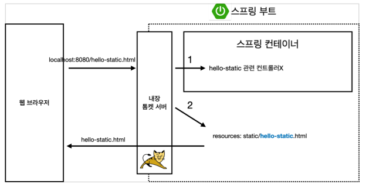
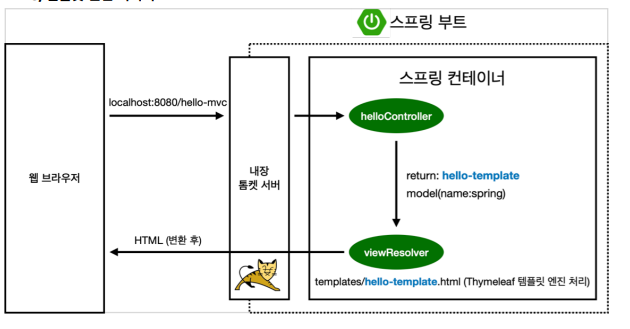
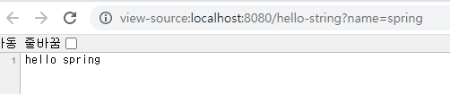

# 스프링 웹 개발 기초

### 정적 컨텐츠
+ 파일을 그대로 웹 브라우저(고객)에게 전달해 주는 것

#### 정적 컨텐츠 공식문서
+ [Spring 공식 문서](https://docs.spring.io/spring-boot/docs/2.3.1.RELEASE/reference/html/spring-bootfeatures.html#boot-features-spring-mvc-static-content)
+ Spring Boot는 클래스 경로에서 /static(또는 /public또는 /resources또는 /META-INF/resources)라는 디렉토리를 찾아감

#### 정적 컨텐츠 흐름

+ 웹 브라우저에서 'localhost:8080/hello-static.html'을 요청
+ 내장 톰캣 서버에서 스프링 컨테이너에게 전송
+ 스프링 컨테이너(우선순위)는 hello-static이라는 controller를 찾음 => 매핑된 controller 없음
+ resorces안에 static 밑에서 찾아서 있으면 웹 브라우저에게 반환해줌
 

### MVC와 템플릿 엔진
+ 서버에서 변형을 통해 동적인 페이지를 전달하는 것

#### MVC
+ model, view, controller
+ 과거에는 view에서 모든 일을 다 했음(MVC1 pattern)
+ 현재는 관심사를 분리한/ 역할을 분리(MVC2 pattern)
+ Controller는 내부적인 것을 처리하는 역할
+ View 화면에 보여주는 역할
+ Model은 화면에서 필요한 부분을 담아 넘겨주는 역할

#### controller 소스
~~~
@GetMapping("hello-mvc")
	public String helloMvc(@RequestParam(value="name", required = false)String name, Model model) {
		model.addAttribute("name",name);
		
		return "hello-template";
	}
~~~
+ 아무런 설정을 안해주면 required 가 true임으로 설정을 해주어야 주소에 값을 넘기지 않아도 창이 뜸

#### MVC 흐름

+ 웹 브라우저에서 'localhost:8080/hello-static.html'을 요청
+ 내장 톰캣서버에서 MVC가 왔다고 Spring에게 던짐
+ 'helloController'에서 매핑된 주소를 찾음
+ return : hello-template/ model(name:spring) 보내줌
+ ViewResolver가 templates밑에 hello-template.html을 찾아 웹 브라우저에게 변환을 해서 반환해줌(Thymeleaf 템플릿 엔진 처리)
 

### API
+ JSON 데이터 포맷으로 클라이언트에게 데이터를 전달하는 것

#### controller 소스
~~~
	@GetMapping("hello-string")
	@ResponseBody
	public String ghelloString(@RequestParam("name") String name) {
		return "hello " + name;
	}

	@GetMapping("hello-api")
	@ResponseBody
	public Hello helloApi(@RequestParam("name") String name) {
		Hello hello = new Hello();
		hello.setName(name);
		return hello;
	}
	
	static class Hello{
		private String name;

		public String getName() {
			return name;
		}

		public void setName(String name) {
			this.name = name;
		}

	}
~~~
+ http = header + Body
+ @ResponseBody 는 http안에 Body부에 직접 내가 넣어주겠다는 의미
+ MVC와의 차이점은 View가 존재하지 않기 떄문에 값이 그대로 넘어감

+ 소스보면 HTML 소스없이 값만 있는 것을 볼 수 있음